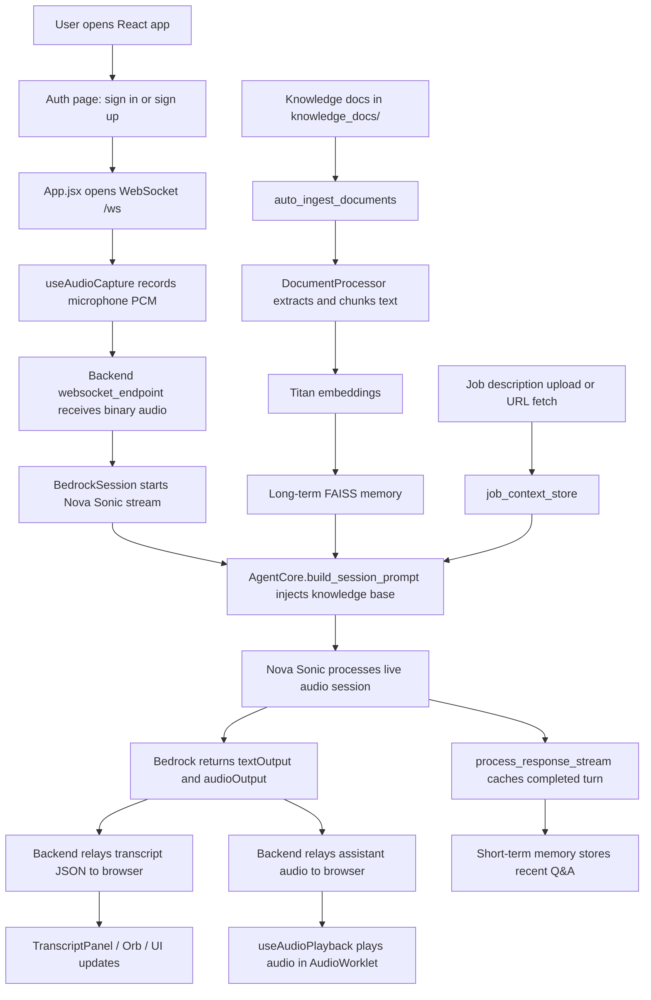

# Voice Assistant Project Summary

This repository builds a real-time voice assistant with a FastAPI backend, a React frontend, Amazon Nova Sonic for bidirectional speech generation, Amazon Titan embeddings for document vectors, FAISS for local retrieval, and OpenTelemetry for tracing. The system is designed around a session-based voice flow, a document knowledge base, user authentication, and an agent layer that injects the right context into each Nova Sonic session.

The main runtime files are [backend/server.py](backend/server.py), [backend/agent_core.py](backend/agent_core.py), [backend/document_processor.py](backend/document_processor.py), [backend/memory_short_term.py](backend/memory_short_term.py), [backend/memory_long_term.py](backend/memory_long_term.py), [backend/auth.py](backend/auth.py), [backend/telemetry.py](backend/telemetry.py), and the React app under [frontend/src](frontend/src).

## 1. Simple Flow, Main Functions, and Frontend/Backend Structure

The project flow is simple at a high level, but the runtime has several linked layers:

1. The user opens the React app and either signs in or signs up through [frontend/src/AuthPage.jsx](frontend/src/AuthPage.jsx), which talks to the FastAPI auth routes in [backend/auth.py](backend/auth.py).
2. After login, the main UI in [frontend/src/App.jsx](frontend/src/App.jsx) opens a WebSocket to `/ws` through [frontend/src/hooks/useWebSocket.js](frontend/src/hooks/useWebSocket.js).
3. When the user starts a voice session, [frontend/src/hooks/useAudioCapture.js](frontend/src/hooks/useAudioCapture.js) captures microphone audio as 16 kHz PCM and sends it to the backend as binary frames.
4. The backend WebSocket endpoint in [backend/server.py](backend/server.py) creates a per-connection `BedrockSession`, starts a Nova Sonic bidirectional stream, and sends a dynamic system prompt built by `AgentCore`.
5. Bedrock sends back text and audio events. The backend relays transcript text to the browser as JSON and audio as binary frames.
6. The browser plays the assistant audio using [frontend/src/hooks/useAudioPlayback.js](frontend/src/hooks/useAudioPlayback.js), which buffers PCM in an AudioWorklet to reduce stutter.
7. Conversation turns are shown in [frontend/src/components/TranscriptPanel.jsx](frontend/src/components/TranscriptPanel.jsx), and session state is visualized by [frontend/src/components/Orb.jsx](frontend/src/components/Orb.jsx) and the CSS in [frontend/src/index.css](frontend/src/index.css).

The frontend is a single-page React app with a few clear responsibilities:

- [frontend/src/App.jsx](frontend/src/App.jsx) controls session state, transcript state, history persistence, logout, and the job description uploader.
- [frontend/src/hooks/useWebSocket.js](frontend/src/hooks/useWebSocket.js) owns the socket connection, reconnect logic, and message parsing.
- [frontend/src/hooks/useAudioCapture.js](frontend/src/hooks/useAudioCapture.js) owns microphone acquisition and PCM encoding.
- [frontend/src/hooks/useAudioPlayback.js](frontend/src/hooks/useAudioPlayback.js) owns audio playback and buffering.
- [frontend/src/components/JobDescriptionUploader.jsx](frontend/src/components/JobDescriptionUploader.jsx) uploads a job description file or fetches one from a URL.
- [frontend/src/AuthPage.jsx](frontend/src/AuthPage.jsx) handles the login and signup flow.

The backend is a FastAPI service with three major roles:

- Authentication and user identity in [backend/auth.py](backend/auth.py).
- Voice session handling, Nova Sonic streaming, job description storage, and startup ingestion in [backend/server.py](backend/server.py).
- Retrieval, memory, and prompt orchestration in [backend/agent_core.py](backend/agent_core.py), [backend/memory_short_term.py](backend/memory_short_term.py), [backend/memory_long_term.py](backend/memory_long_term.py), and [backend/document_processor.py](backend/document_processor.py).

### Overall Flow Chart

This diagram shows the main runtime path from login to voice streaming, retrieval, and playback.

The project also contains deployment and packaging files that explain how the system is intended to run in development and AWS:

- [package.json](package.json) defines root commands for local development and backend/frontend installs.
- [docker-compose.yml](docker-compose.yml) runs the two containers locally.
- [backend/Dockerfile](backend/Dockerfile) and [frontend/Dockerfile](frontend/Dockerfile) build production containers.
- [ecs-backend-task.json](ecs-backend-task.json), [ecs-frontend-task.json](ecs-frontend-task.json), and [ecs-trust-policy.json](ecs-trust-policy.json) define the ECS/Fargate deployment shape.
- [deploy_ecs.py](deploy_ecs.py) forces a new ECS deployment.
- [run_ingest.py](backend/run_ingest.py) is a convenience script for ingesting the knowledge base manually.

## 2. Nova Sonic and Bedrock Implementation: Important Functions, Packages, and Files

The live voice system is implemented primarily in [backend/server.py](backend/server.py). The key Bedrock pieces are:

- `create_bedrock_client()` refreshes AWS credentials from the current environment or ECS metadata before each voice session. This avoids stale temporary credentials during long-running tasks.
- `BedrockSession` owns one user connection and one Nova Sonic stream.
- `send_setup_events()` sends the session start, prompt start, system prompt, and audio content start events that Nova Sonic expects.
- `process_response_stream()` reads the streamed Bedrock responses, decodes the event payloads, extracts transcripts, forwards assistant audio, and detects turn endings.
- `handle_audio_input()` converts browser PCM into a base64 Bedrock audio event.
- `start()` opens the bidirectional Bedrock session and launches the sender loop, audio flush loop, and response reader.
- `stop()` cleanly ends the audio stream, prompt, and session, then cancels the background tasks.
- The `/ws` endpoint routes browser messages into the `BedrockSession` and tears the session down on disconnect.

The Bedrock event sequence used by this repository is important:

- `sessionStart` initializes the model turn.
- `promptStart` opens a prompt container.
- `contentStart` with role `SYSTEM` sends the system prompt.
- `textInput` carries the dynamically built prompt text.
- Another `contentStart` with role `USER` and type `AUDIO` opens the live audio input channel.
- `audioInput` streams microphone PCM to Nova Sonic.
- `textOutput` and `audioOutput` are streamed back by Bedrock as the assistant responds.
- `contentEnd`, `promptEnd`, and `sessionEnd` close the turn and the session.

The Nova Sonic setup is configured with these constants in [backend/server.py](backend/server.py):

- `MODEL_ID = "amazon.nova-sonic-v1:0"`
- `AUDIO_INPUT_CONFIG` for 16 kHz mono LPCM from the browser
- `AUDIO_OUTPUT_CONFIG` for 24 kHz mono LPCM to the browser
- `TEXT_CONFIG` for plain text prompt content

The document and embedding side of the Bedrock pipeline lives in [backend/document_processor.py](backend/document_processor.py):

- `EmbeddingService` calls `bedrock-runtime` with `amazon.titan-embed-text-v2:0`.
- `generate_embedding()` produces a 1024-dimensional vector for one text chunk.
- `generate_embeddings()` loops through all chunks and falls back to a zero vector if one chunk fails.
- `DocumentProcessor.ingest_document()` extracts text, chunks it, embeds it, wraps each chunk in `DocumentChunk`, and stores it in FAISS.
- `extract_text()` routes PDF, TXT, DOCX, CSV, MD, and JSON content to the correct extractor.
- `chunk_text()` splits long text into overlapping chunks so context is not lost at boundaries.

The important packages for this layer are listed in [backend/requirements.txt](backend/requirements.txt):

- `aws-sdk-bedrock-runtime` for the bidirectional Nova Sonic client and event types.
- `boto3` for Titan embedding calls, S3 backup, and AWS credential handling.
- `faiss-cpu` and `numpy` for vector storage and search.
- `PyPDF2`, `python-docx`, and standard-library `csv` parsing for document extraction.
- `httpx` and `beautifulsoup4` for job description URL fetching.
- `opentelemetry-*` packages for tracing.

The live Bedrock flow in this codebase is session-oriented, not turn-by-turn text chat. That means `AgentCore.build_session_prompt()` is used to inject the knowledge base at session start, while `AgentCore.process_query()` exists as a per-query RAG helper for retrieval-style use cases. The websocket path currently uses the session prompt approach because Nova Sonic keeps one system prompt for the whole voice session.

## 3. Agent Core: Core Concepts, Important Functions, Packages, and Files

The agent layer is defined in [backend/agent_core.py](backend/agent_core.py). It is the orchestrator that decides what prompt Nova Sonic should see, how recent conversation is reused, and when document retrieval should be used.

The main data class is:

- `QueryResult`, which carries the final prompt, the retrieval source, the retrieved chunks, and a confidence score.

The most important class is `AgentCore`:

- `BASE_SYSTEM_PROMPT` is the fallback prompt when no document context is available.
- `RAG_SYSTEM_PROMPT` is the prompt template for retrieval-augmented answers when relevant context exists.
- `SESSION_RAG_PROMPT` is the full-session prompt that injects the entire knowledge base into Nova Sonic at connection start.
- `ELIGIBILITY_PROMPT` adds job-description comparison instructions when a job description is loaded.
- `process_query()` checks short-term memory first, then long-term memory, and builds an augmented prompt from the best match.
- `cache_response()` stores a completed Q&A turn back into short-term memory.
- `clear_session()` wipes the session cache when the websocket disconnects.
- `get_stats()` merges stats from both memory systems.
- `_search_long_term()` turns the query into an embedding and searches FAISS.
- `_build_history_text()` formats the most recent turns into a compact conversation history block.
- `build_session_prompt()` loads all known document chunks, groups them by source document, truncates the prompt if needed, and optionally appends a job description section.

The agent logic is built around these concepts:

- Short-term memory handles recent conversational repetition quickly.
- Long-term memory handles semantic retrieval from the document knowledge base.
- The prompt builder turns retrieved or cached context into an instruction set that Nova Sonic can use directly.
- Job description context is treated as a separate input stream so the assistant can compare the candidate profile against a JD.

The telemetry connection is embedded inside this file too:

- `get_tracer("agent_core")` creates a module-specific tracer.
- `process_query()`, `_search_long_term()`, and `build_session_prompt()` all create spans and attach useful attributes such as session ID, retrieval source, confidence, chunk counts, and prompt length.

The memory classes that AgentCore depends on are:

- [backend/memory_short_term.py](backend/memory_short_term.py) for session cache lookup and history.
- [backend/memory_long_term.py](backend/memory_long_term.py) for FAISS document search.
- [backend/document_processor.py](backend/document_processor.py) for embeddings.
- [backend/telemetry.py](backend/telemetry.py) for tracing.

One important implementation detail is that the live websocket flow does not call `process_query()` today. Instead, the backend uses `build_session_prompt()` once at session start and then caches completed turns after the assistant speaks. That is the reason the agent is shaped more like a session prompt builder than a per-message chatbot router in the live voice path.

## 4. Telemetry: How It Works, Important Functions, and How the Pieces Link

Telemetry is implemented in [backend/telemetry.py](backend/telemetry.py) and initialized at backend startup from [backend/server.py](backend/server.py).

The important functions are:

- `init_telemetry()` configures the global OpenTelemetry tracer provider.
- `get_tracer(module_name)` returns a tracer for the requesting module.

`init_telemetry()` does three important things:

- It sets the OpenTelemetry resource service name to `voice-assistant-backend` so the service appears correctly in AWS observability tooling.
- It uses `AwsXRayIdGenerator()` so trace IDs are compatible with AWS X-Ray.
- It adds an `OTLPSpanExporter` pointing at `http://localhost:4317`, which is the standard local ADOT sidecar port.

The link between telemetry and the rest of the app is direct:

- [backend/server.py](backend/server.py) calls `init_telemetry()` on startup.
- [backend/agent_core.py](backend/agent_core.py) imports `get_tracer()` and creates spans around the memory search and prompt-building operations.
- The spans carry useful attributes that make the runtime behavior observable, such as the session ID, whether the match came from short-term or long-term memory, and whether the prompt was truncated.

In practice, this means you can trace how a voice turn moved through the system:

- The browser sends audio to `/ws`.
- The backend session starts and builds a prompt.
- The agent searches memory or injects the full knowledge base.
- Bedrock streams the response.
- The assistant response is cached for the next turn.

That observability chain is especially important in this project because the system combines realtime audio, asynchronous WebSocket handling, AWS SDK calls, and vector retrieval. Without traces, it would be hard to diagnose whether a failure came from Bedrock, memory search, prompt construction, or the browser connection.

## 5. Short-Term Memory and Long-Term Memory: Concept and Backend Implementation

The memory system is split into two layers for speed and relevance.

### Short-Term Memory

[backend/memory_short_term.py](backend/memory_short_term.py) implements a per-session in-memory cache.

Important pieces:

- `MemoryEntry` stores the query, assistant response, retrieval context, and timestamp.
- `ShortTermMemory.store()` adds a new turn, evicts expired entries, and enforces a per-session maximum.
- `ShortTermMemory.search()` uses `TfidfVectorizer` and cosine similarity to find a recently asked similar question.
- `ShortTermMemory.get_recent_context()` returns the most recent turns so the assistant can preserve conversational continuity.
- `ShortTermMemory.clear_session()` deletes all entries for a closed session.
- `ShortTermMemory.get_stats()` exposes active session counts and capacity information.

How it works conceptually:

- It is fast because it stays in memory and uses TF-IDF instead of embeddings.
- It is session-scoped, so one user does not leak context into another user’s session.
- It is short-lived, because entries expire after the configured TTL.

In [backend/server.py](backend/server.py), the backend creates `ShortTermMemory(max_entries=50, ttl_minutes=30)`, so each session has up to 50 recent turns and a 30 minute TTL.

### Long-Term Memory

[backend/memory_long_term.py](backend/memory_long_term.py) implements the document vector store on top of FAISS.

Important pieces:

- `DocumentChunk` stores chunk text plus metadata such as source filename, page number, chunk index, and document ID.
- `SearchResult` pairs a chunk with a similarity score and rank.
- `LongTermMemory.add_documents()` normalizes embeddings, adds them to the FAISS index, and persists both index and metadata to disk.
- `LongTermMemory.search()` normalizes the query vector and retrieves the top matches using L2 distance.
- `LongTermMemory.delete_document()` removes every chunk that belongs to one document ID.
- `LongTermMemory.list_documents()` summarizes what is already indexed.
- `LongTermMemory.get_all_chunks()` returns the full knowledge base for session prompt injection.
- `LongTermMemory._save()` and `_load()` persist the vector index and chunk metadata.
- `LongTermMemory.get_stats()` returns counts and index settings.

How it works conceptually:

- Documents are first broken into chunks by [backend/document_processor.py](backend/document_processor.py).
- Each chunk becomes a 1024-dimensional Titan embedding.
- FAISS stores the vectors locally, and `metadata.json` stores the chunk metadata beside `index.faiss`.
- The repository can auto-load the knowledge base on startup from [backend/server.py](backend/server.py) through `auto_ingest_documents()`.

### How the Two Memories Connect

The sequence is:

1. A document is ingested and chunked.
2. The chunks are embedded and inserted into FAISS.
3. A voice query arrives.
4. `AgentCore` checks short-term memory first.
5. If no recent match exists, `AgentCore` searches long-term memory.
6. The response is generated with the correct context.
7. The completed turn is cached back into short-term memory.
8. On disconnect, the session cache is cleared.

This design is why the app feels responsive while still being grounded in a document store.

## 6. Other Important Backend Files and Features

- [backend/auth.py](backend/auth.py) implements JWT-based signup, login, current-user lookup, and SQLite persistence with SQLAlchemy.
- `init_db()` creates the user table and seeds test users if the database is empty.
- `get_current_user()` protects authenticated endpoints, including job description operations.
- [backend/server.py](backend/server.py) also exposes `/health` and `/api/memory/status`.
- The `job_context_store` inside [backend/server.py](backend/server.py) keeps one job description per username in memory. This is fast but not durable across backend restarts and is not shared across multiple backend instances.
- `auto_ingest_documents()` scans the knowledge document folder on startup and only processes new supported files.
- `SUPPORTED_EXTENSIONS` currently includes PDF, TXT, DOCX, CSV, MD, and JSON.
- `run_ingest.py` is a manual startup helper for ingesting the knowledge base without running the whole app.

## 7. Frontend Details Worth Knowing

The React app in [frontend/src](frontend/src) is intentionally structured around the live voice loop.

- [frontend/src/App.jsx](frontend/src/App.jsx) maintains auth state, live transcript state, per-user session history in localStorage, the current voice state, and error display.
- It uses `crypto.randomUUID()` for transcript and history IDs.
- It lets the user toggle the session with a single action button or the spacebar.
- It shows the selected history when idle and the live transcript during an active session.

The audio pieces are worth calling out:

- [frontend/src/hooks/useAudioCapture.js](frontend/src/hooks/useAudioCapture.js) captures microphone input through an AudioWorklet and posts fixed-size PCM chunks to the backend.
- [frontend/src/hooks/useAudioPlayback.js](frontend/src/hooks/useAudioPlayback.js) uses a pull-based FIFO AudioWorklet to keep playback smooth even when websocket timing jitters.
- The playback hook was designed specifically to avoid stutter by priming a buffer and adapting after underruns.

The UI components are small but deliberate:

- [frontend/src/components/Orb.jsx](frontend/src/components/Orb.jsx) renders the animated state orb.
- [frontend/src/components/TranscriptPanel.jsx](frontend/src/components/TranscriptPanel.jsx) auto-scrolls and formats user versus assistant lines.
- [frontend/src/components/ErrorBar.jsx](frontend/src/components/ErrorBar.jsx) shows transient errors.
- [frontend/src/components/JobDescriptionUploader.jsx](frontend/src/components/JobDescriptionUploader.jsx) uploads a file or fetches a URL and keeps the JD status visible.
- [frontend/src/index.css](frontend/src/index.css) defines the visual system and the session-state animations.

The root frontend dependencies in [frontend/package.json](frontend/package.json) are mainly React, Framer Motion, Axios, and the AWS Amplify UI packages. The app is built with Vite.

## 8. Local Development, Docker, and ECS Structure

The repo is set up for both local development and AWS deployment.

- The root [package.json](package.json) provides combined dev and build scripts.
- `npm run dev` starts the backend and frontend together locally.
- `npm run start` starts the backend only.
- `npm run build` builds the frontend.
- `npm run install:all` installs Python and Node dependencies in one step.

Containerization is split cleanly:

- [backend/Dockerfile](backend/Dockerfile) installs Python dependencies, copies the backend code, copies knowledge documents, creates the FAISS directory, and runs Uvicorn on port 3000.
- [frontend/Dockerfile](frontend/Dockerfile) builds the React app and serves it through Nginx.
- [docker-compose.yml](docker-compose.yml) wires the backend and frontend together for a local two-container setup.

AWS deployment artifacts are also present:

- [ecs-backend-task.json](ecs-backend-task.json) defines the backend Fargate task, ports, environment variables, health check, and CloudWatch logging.
- [ecs-frontend-task.json](ecs-frontend-task.json) defines the frontend Fargate task and logging.
- [ecs-trust-policy.json](ecs-trust-policy.json) allows ECS tasks to assume the execution role.
- [deploy_ecs.py](deploy_ecs.py) forces a new ECS deployment and stops existing tasks to speed up rollout.

The documentation in [guide.md](guide.md) is specifically about the Lambda JWT authorizer setup for AWS API Gateway. It is deployment guidance rather than application logic, but it matters if you want the backend protected by an API Gateway authorizer in front of ECS.

## 9. Important Files at a Glance

- [backend/server.py](backend/server.py): FastAPI app, WebSocket session manager, Bedrock streaming, job description APIs, auto-ingestion, startup bootstrap.
- [backend/agent_core.py](backend/agent_core.py): Prompt orchestration, retrieval hierarchy, session prompt builder, memory statistics.
- [backend/document_processor.py](backend/document_processor.py): Extraction, chunking, Titan embeddings, document ingestion, optional S3 backup.
- [backend/memory_short_term.py](backend/memory_short_term.py): Session cache with TF-IDF search and TTL.
- [backend/memory_long_term.py](backend/memory_long_term.py): FAISS document store and persistence.
- [backend/auth.py](backend/auth.py): JWT authentication and SQLite user storage.
- [backend/telemetry.py](backend/telemetry.py): OpenTelemetry and AWS X-Ray setup.
- [frontend/src/App.jsx](frontend/src/App.jsx): Main UI and session controller.
- [frontend/src/AuthPage.jsx](frontend/src/AuthPage.jsx): Login and signup screen.
- [frontend/src/hooks/useWebSocket.js](frontend/src/hooks/useWebSocket.js): WebSocket connection manager.
- [frontend/src/hooks/useAudioCapture.js](frontend/src/hooks/useAudioCapture.js): Mic capture and PCM conversion.
- [frontend/src/hooks/useAudioPlayback.js](frontend/src/hooks/useAudioPlayback.js): Audio playback FIFO and jitter handling.
- [frontend/src/components/JobDescriptionUploader.jsx](frontend/src/components/JobDescriptionUploader.jsx): Job description file and URL input.
- [docker-compose.yml](docker-compose.yml): Local orchestration.
- [backend/Dockerfile](backend/Dockerfile) and [frontend/Dockerfile](frontend/Dockerfile): Production images.
- [ecs-backend-task.json](ecs-backend-task.json) and [ecs-frontend-task.json](ecs-frontend-task.json): ECS task definitions.

## 10. Notes on Ancillary Files

The repository root also contains many `logs`, `ecs_*`, `tail`, and similar text/json files. Those are diagnostic artifacts from debugging and deployment runs, not core runtime code. They are useful when tracing failures, but they do not change how the application itself works.

If you want the shortest possible mental model, it is this:

- Frontend captures voice and shows state.
- Backend turns voice into Nova Sonic events.
- AgentCore builds the session prompt from memory and documents.
- DocumentProcessor turns files into vectors.
- Short-term memory remembers recent turns.
- Long-term memory stores the knowledge base.
- Telemetry records what happened.

## 11. Detailed Function Reference: Backend

This section explains the important backend functions and classes one by one.

### `backend/server.py`

- `auto_ingest_documents()`
	- Scans the knowledge document directory at startup.
	- Skips files that are already indexed.
	- Reads each new file and passes it to `DocumentProcessor.ingest_document()`.
	- Exists so the assistant can load new documents without manual reindexing.

- `create_bedrock_client()`
	- Refreshes AWS credentials from the current runtime environment.
	- Rewrites the credential environment variables so the Bedrock client uses fresh values.
	- Creates the Bedrock runtime client used by Nova Sonic sessions.
	- Prevents stale temporary credentials from breaking long voice sessions.

- `BedrockSession.__init__(ws, agent)`
	- Sets up the per-WebSocket session state.
	- Creates session IDs, queues, buffers, and response tracking fields.
	- Stores references to the browser socket and the `AgentCore` instance.

- `BedrockSession._sender_loop()`
	- Drains queued JSON messages and sends them to the browser.
	- Keeps outbound text traffic separate from the Bedrock response reader.
	- Reduces blocking when browser communication is slower than model streaming.

- `BedrockSession._audio_flush_loop()`
	- Batches assistant audio into periodic binary frames.
	- Prevents the browser from receiving too many tiny packets.
	- Improves playback smoothness.

- `BedrockSession.send_json(obj)`
	- Queues a JSON object for browser delivery.
	- Used for transcript updates, state changes, and error messages.

- `BedrockSession.send_audio(data)`
	- Appends audio bytes to the pending audio buffer.
	- The flush loop later forwards the accumulated bytes to the browser.

- `BedrockSession.push_event(event_obj)`
	- Sends a Bedrock input event to the open bidirectional stream.
	- Used for `sessionStart`, `promptStart`, `textInput`, and `audioInput` events.

- `BedrockSession.push_event_force(event_obj)`
	- Sends a Bedrock event even during teardown.
	- Used for clean shutdown events like `contentEnd`, `promptEnd`, and `sessionEnd`.

- `BedrockSession.send_setup_events()`
	- Builds the initial Nova Sonic session structure.
	- Sends the system prompt, opens the audio input block, and prepares the model to listen.
	- Uses `AgentCore.build_session_prompt()` so the entire knowledge base is available for the voice session.

- `BedrockSession.process_response_stream()`
	- Reads streamed Bedrock output events.
	- Extracts text output, assistant audio, and turn boundaries.
	- Caches completed turns back into short-term memory.
	- Sends transcript and state events back to the browser.

- `BedrockSession.start()`
	- Opens the Bedrock bidirectional stream.
	- Sends setup events.
	- Starts the sender loop, audio flush loop, and response reader.

- `BedrockSession.handle_audio_input(pcm_buffer)`
	- Encodes browser PCM as base64.
	- Wraps it in an `audioInput` Bedrock event.
	- Sends it to the model while the session is active.

- `BedrockSession.stop()`
	- Sends the closing Bedrock events.
	- Closes the input stream.
	- Cancels background tasks and clears audio buffers.
	- Leaves the session in a safe idle state.

- `websocket_endpoint(ws)`
	- Accepts the browser WebSocket connection.
	- Creates a `BedrockSession` for that connection.
	- Routes binary frames into `handle_audio_input()` and JSON messages into session control.
	- On disconnect, stops the session and clears session memory.

- `startup_banner()`
	- Runs once when the FastAPI app starts.
	- Initializes the database and telemetry.
	- Launches automatic document ingestion in a background thread.

### `backend/document_processor.py`

- `EmbeddingService.client`
	- Lazily creates the Bedrock runtime client for embedding calls.
	- Avoids creating AWS clients until they are actually needed.

- `EmbeddingService.generate_embedding(text)`
	- Calls Titan embedding for a single text chunk.
	- Returns a 1024-dimensional vector.
	- Used by long-term memory ingestion and search.

- `EmbeddingService.generate_embeddings(texts)`
	- Iterates over many text chunks.
	- Generates embeddings one by one and falls back to a zero vector if a chunk fails.

- `extract_text_from_pdf(file_bytes)`
	- Uses `PyPDF2` to extract text page by page.
	- Prefixes the text with page markers.

- `extract_text_from_docx(file_bytes)`
	- Reads paragraph text from a Word document.
	- Returns cleaned, joined text.

- `extract_text_from_csv(file_bytes)`
	- Converts CSV rows into readable text lines.
	- Preserves column names when headers exist.

- `extract_text_from_txt(file_bytes)`
	- Decodes plain text content.

- `extract_text(file_bytes, filename)`
	- Chooses the correct extractor based on the file extension.
	- Raises an error if the file type is unsupported or empty.

- `chunk_text(text, chunk_size, overlap)`
	- Splits large text into overlapping chunks.
	- Tries to keep sentence boundaries intact when possible.
	- Makes document retrieval more useful by preserving context at chunk edges.

- `DocumentProcessor.ingest_document(file_bytes, filename)`
	- Runs the full ingestion pipeline.
	- Extracts text, chunks it, embeds each chunk, wraps the chunks with metadata, and stores them in FAISS.
	- Returns a summary of what was ingested.

- `DocumentProcessor.delete_document(doc_id)`
	- Removes a document and its chunks from long-term storage.
	- Also removes the S3 backup if configured.

- `DocumentProcessor.list_documents()`
	- Returns a summary of indexed documents.

- `DocumentProcessor._upload_to_s3(...)` and `_delete_from_s3(...)`
	- Optional helpers for backing up raw documents to S3.
	- They do not block ingestion if S3 is unavailable.

### `backend/agent_core.py`

- `QueryResult`
	- Holds the final prompt, source of retrieved context, matched chunks, and a confidence score.

- `AgentCore.__init__(short_term, long_term, embedding_service)`
	- Stores the memory and embedding dependencies needed by the agent.

- `AgentCore.process_query(session_id, query)`
	- Checks short-term memory first.
	- Falls back to long-term document search when needed.
	- Builds the final augmented prompt and returns it in a `QueryResult`.

- `AgentCore.cache_response(session_id, query, response, context)`
	- Saves a completed turn into short-term memory.

- `AgentCore.clear_session(session_id)`
	- Deletes all short-term memory for a finished session.

- `AgentCore.get_stats()`
	- Merges memory statistics from short-term and long-term stores.

- `AgentCore._search_long_term(query)`
	- Embeds the query and searches FAISS for semantically similar chunks.

- `AgentCore._build_history_text(session_id)`
	- Formats recent cached turns into a short conversation history block.

- `AgentCore.build_session_prompt(job_description, job_source)`
	- Loads all document chunks.
	- Groups them by source document.
	- Truncates the prompt if needed.
	- Optionally appends the job description section.
	- Returns the full session-level prompt used for Nova Sonic.

### `backend/memory_short_term.py`

- `MemoryEntry.is_expired(ttl_seconds)`
	- Checks whether a cached turn is older than the TTL.

- `ShortTermMemory.store(session_id, query, response, context)`
	- Adds a new memory entry.
	- Removes expired entries and enforces the per-session size limit.

- `ShortTermMemory.search(session_id, query, threshold)`
	- Uses TF-IDF and cosine similarity to find a recent similar query.
	- Returns the best entry if it clears the similarity threshold.

- `ShortTermMemory.get_recent_context(session_id, n)`
	- Returns the most recent cached turns for prompt building.

- `ShortTermMemory.clear_session(session_id)`
	- Deletes all entries for one session.

- `ShortTermMemory.get_stats()`
	- Reports active session count, entry count, TTL, and capacity.

### `backend/memory_long_term.py`

- `LongTermMemory.add_documents(chunks, embeddings)`
	- Normalizes and stores vectors in FAISS.
	- Persists both the FAISS index and chunk metadata.

- `LongTermMemory.search(query_embedding, top_k, score_threshold)`
	- Searches the vector store for the most similar document chunks.

- `LongTermMemory.delete_document(doc_id)`
	- Rebuilds the index without the removed document.

- `LongTermMemory.list_documents()`
	- Returns a grouped summary of stored documents.

- `LongTermMemory.get_all_chunks()`
	- Returns all chunk metadata, used when building a session prompt.

- `LongTermMemory.get_stats()`
	- Reports vector count, document count, dimension, and index path.

- `LongTermMemory._save()` and `_load()`
	- Persist and restore the vector index plus metadata.

### `backend/telemetry.py`

- `init_telemetry()`
	- Configures the OpenTelemetry provider.
	- Uses AWS X-Ray compatible IDs and OTLP export.

- `get_tracer(module_name)`
	- Returns a tracer for a specific module.

### `backend/auth.py`

- `verify_password(plain_password, hashed_password)`
	- Compares a plaintext password to its bcrypt hash.

- `get_password_hash(password)`
	- Produces a bcrypt hash for storage.

- `create_access_token(data, expires_delta)`
	- Creates a JWT access token.

- `get_current_user(token, db)`
	- Validates the bearer token and loads the matching user from the database.

- `signup(...)`
	- Creates a new user and returns a JWT.

- `login(...)`
	- Validates credentials and returns a JWT.

- `read_users_me(current_user)`
	- Returns the current authenticated user profile.

- `init_db()`
	- Creates the user table and seeds test users when the database is empty.

## 12. Detailed Function Reference: Frontend

### `frontend/src/hooks/useWebSocket.js`

- `connect()`
	- Opens the WebSocket connection.
	- Installs handlers for state, transcript, audio, error, and reconnect behavior.

- `sendJSON(obj)`
	- Sends a JSON message to the backend if the socket is open.

- `sendBinary(buffer)`
	- Sends a binary audio frame to the backend.

### `frontend/src/hooks/useAudioCapture.js`

- `startMicrophone()`
	- Requests microphone permission.
	- Creates an AudioContext and an AudioWorklet for PCM conversion.
	- Streams Int16 PCM chunks to the app callback.

- `stopMicrophone()`
	- Stops capture, closes the audio context, and releases media tracks.

### `frontend/src/hooks/useAudioPlayback.js`

- `setupWorklet()`
	- Creates the playback AudioWorklet.
	- Prebuffers and plays assistant audio smoothly.

- `handleAudioResponse(arrayBuffer)`
	- Converts incoming Int16 PCM into Float32 audio.
	- Sends it to the playback worklet.

- `stopPlayback()`
	- Clears buffered audio and closes the playback context.

### `frontend/src/App.jsx`

- `parseUsername(token)`
	- Reads the username from the JWT payload.

- `addTranscriptEntry(role, text)`
	- Appends transcript lines and merges streaming assistant text.

- `startSession()`
	- Starts microphone capture.
	- Sends the `session_start` message to the backend.

- `stopSession()`
	- Stops the session, halts capture and playback, and stores history locally.

### `frontend/src/components/JobDescriptionUploader.jsx`

- `handleFileUpload(e)`
	- Uploads a local JD file to the backend.

- `handleUrlFetch()`
	- Sends a URL to the backend for scraping and text extraction.

- `handleClear()`
	- Deletes the active job description.

### UI components

- `TranscriptPanel`
	- Displays the current conversation turns and keeps the view scrolled to the bottom.

- `ErrorBar`
	- Shows transient error messages from the backend or client hooks.

- `Orb`
	- Visualizes the assistant state with an animated orb.

## 13. Why the Code Is Structured This Way

- The session prompt approach is chosen because Nova Sonic keeps one system prompt per voice session.
- The short-term memory layer exists to avoid expensive vector lookups for repeated questions within the same session.
- The long-term FAISS layer exists so uploaded knowledge documents can be searched semantically.
- The audio worklets exist so the browser can stream and play PCM with less jitter than a default media pipeline.
- The telemetry layer exists because the runtime is asynchronous and distributed enough that tracing matters.

## 14. Short Implementation Summary

- `backend/server.py` owns runtime orchestration.
- `backend/agent_core.py` owns prompt construction and retrieval decisions.
- `backend/document_processor.py` owns ingestion and embeddings.
- `backend/memory_short_term.py` and `backend/memory_long_term.py` own memory storage.
- `backend/auth.py` owns user identity.
- `frontend/src` owns capture, playback, state, and display.
